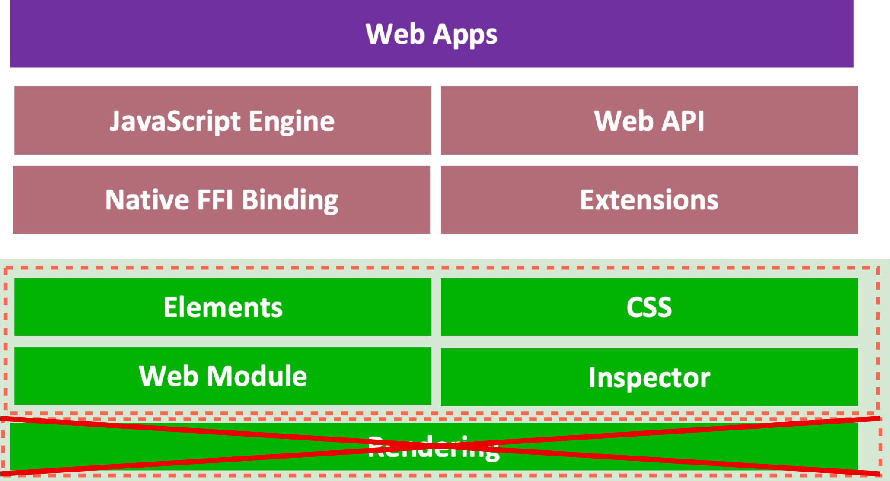

# Headless Mode

## Motivations

Currently in WebF, it is required that the runtime be initialized within the top level of the `Scaffold` of an active app, because it is assumed that the UI is primarily being built with web. However, this imposes a quite large restriction on the usecase of this library; it cannot be used to simply provide a full JavaScript runtime.

The existing alternatives for javascript runtimes in Flutter do not provide the same W3C compatibility that this library does, making this a good potential option for those seeking to drive a javascript backend.

## Design

### The headless mode.



In the headless mode, the Rendering step will will be skipped and all dependence on running within the active `Scaffold` will be removed.

All APIs including the DOM itself will still be available, but will not render to the app, allowing for similar behavior to Puppeteer if needed.

## Enable headless mode

```dart
WebF(
  enableHeadlessMode: true
),
```
