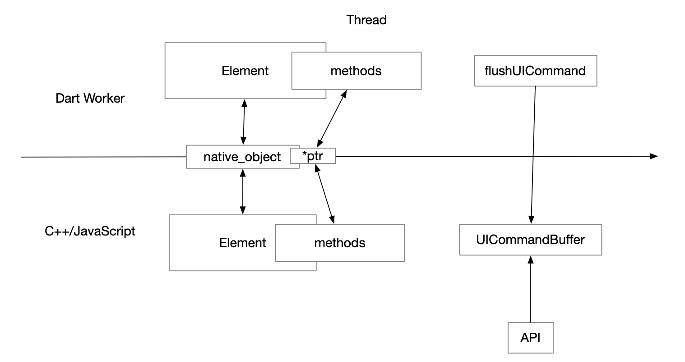
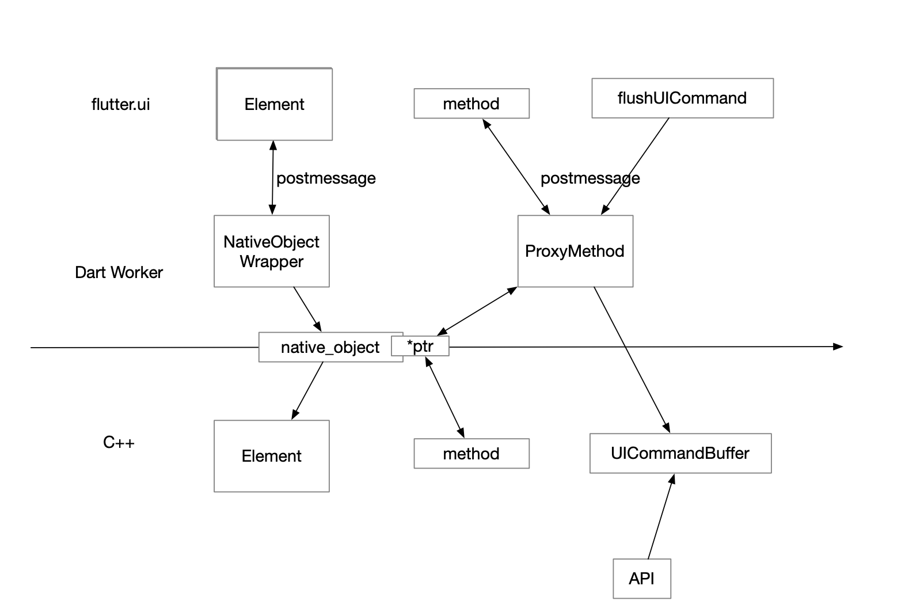
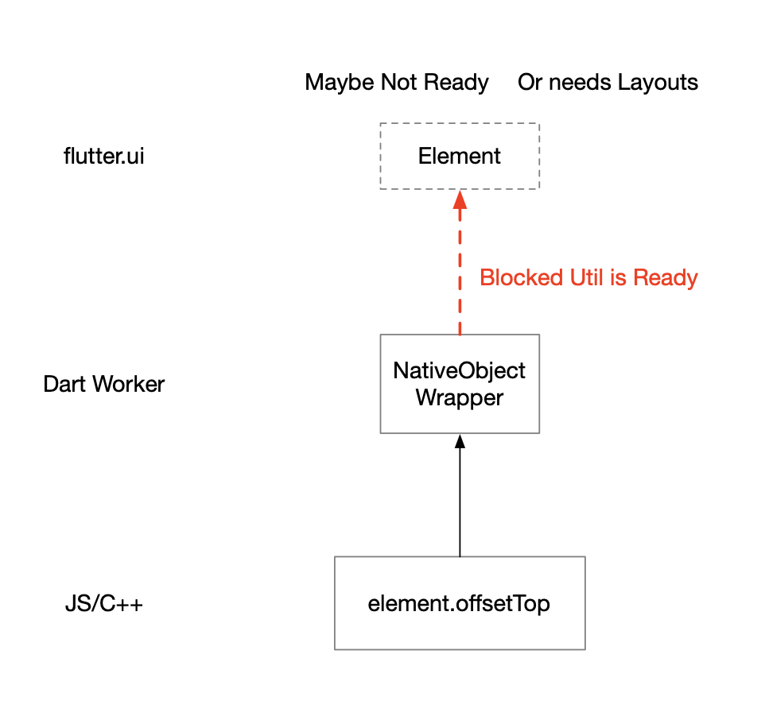
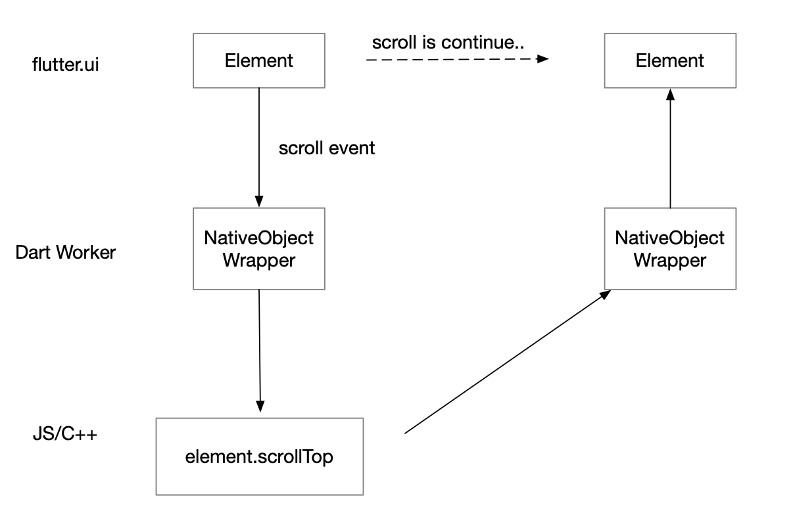

# Multiple Thread Mode

## Motivations

Now in WebF, the JavaScript engine is running in the Flutter UI thread. This brings both advantages and disadvantages. The advantage is lower communication overhead between Dart and JavaScript, which allows us to implement control animation state on JavaScript at 60 FPS. The disadvantage is that JavaScript may block Dart's execution. If the JavaScript takes too much time, it can cause jank in the Flutter application.

If we move the JavaScript to a standalone thread, the advantages and disadvantages in single-thread mode will be reversed. The JavaScript will no longer block the Flutter application, but the communicate overhead will be more expensive. If our apps heavily relies on community between Dart and JavaScript (such as controlling the animation state every frame), it may lost frames because the flutter.ui takes too much time for the next frame information.

In many other cross-platform frames like React-Native, they choose only multiple-thread mode. But in WebF, we want to offer both options, and let users to choose to run theirs apps in either single-threaded mode or multiple-threaded mode.

## Design

### The Single-Threaded mode.



In single-thread mode, we have two ways to communicate between Dart and JavaScript. One is using a shared native object that is accessable from Dart and C++. We put function pointer on this object so we can listen for callbacks from each other. The other way is using the `flushUICommand` function, which reads commands from the UICommandBuffer, we cache all the UICommands in one frame, and in the next frame, they will be read by the `flushUICommand` for further operations.

### The Multiple-threaded mode.



When running in multiple-threaded mode, we add a new layer called NativeObjectWrapper, which proxies all the binding calls from Flutter UI to the Dart worker. JavaScript and C++ are running in the Dart worker thread and share messages via Dart isolate messages.


**Blocked API Call**



Some DOM API's return value rely on the current rendering layout state. In single-threads mode, everything can be blocked by any taske. However, in multiple-threaded mode, we needed to block the Dart worker thread until the flutter.ui returnes the corresponding value.


**Unstabled viewport values**



Since the flutter.ui and JavaScript run in parallel, it can affect the accurancy of the viewport offset APIs.

## Enable Multiple Thread mode

```dart
WebF(
  enableMultipleThreadMode: true
),
```


## Code Generator

We may need to write same API for both single-threaded and multiple-threaded modes. To save our time, we choose to use the code_generator module that is used by bridge bindings to generate dart API codes for single-threaded and multiple-threaded modes.