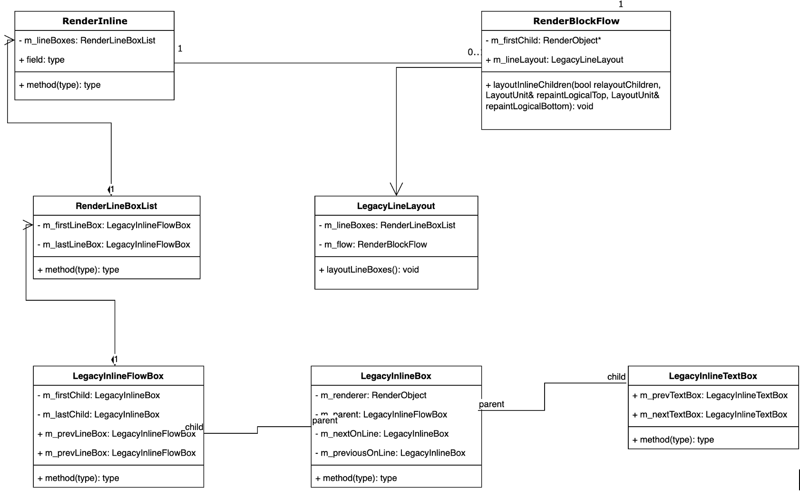
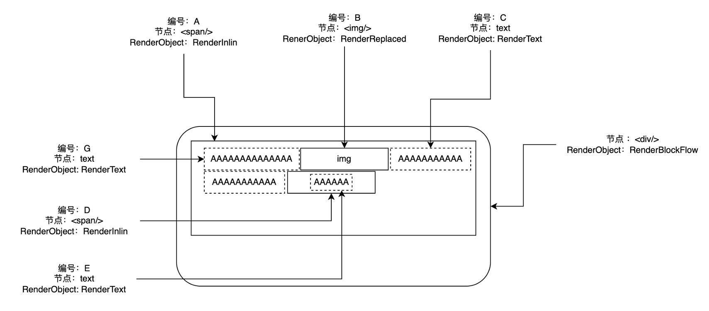
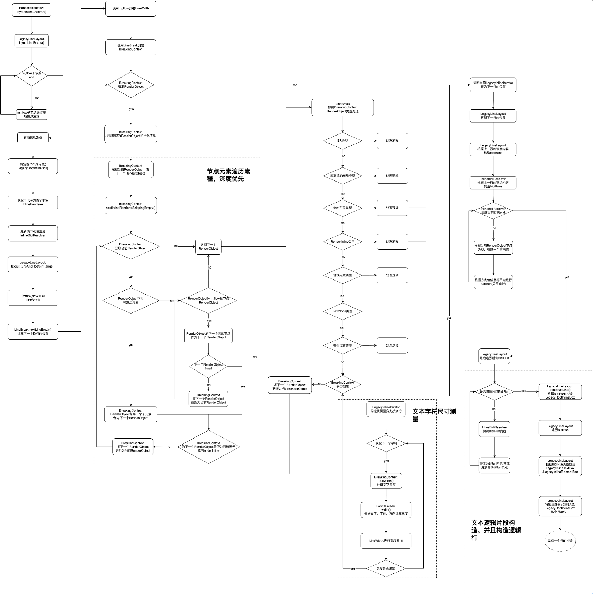
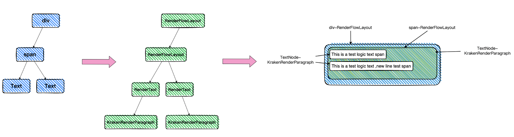
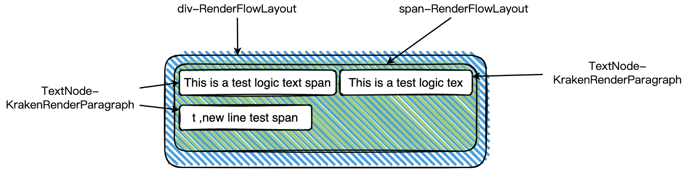
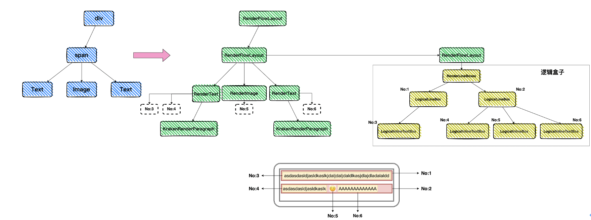
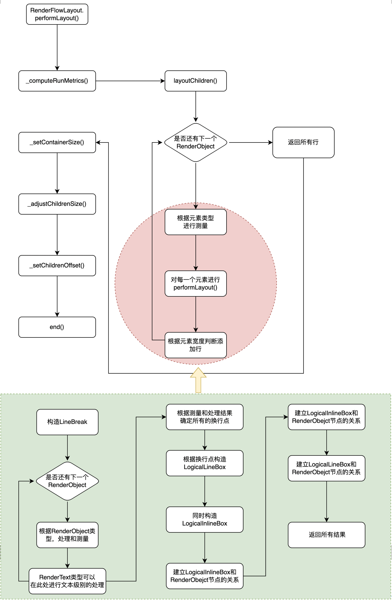
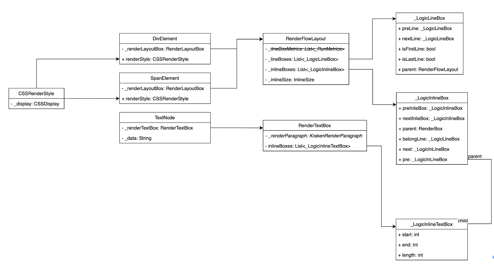

# **【布局】文本排版方案**
- [**【布局】文本排版方案**](#布局文本排版方案)
- [**背景**](#背景)
- [**价值**](#价值)
- [**调研**](#调研)
  - [**WebKit(v2.38.0)，关于flow排版、Inline元素和文本的排版处理方案**](#webkitv2380关于flow排版inline元素和文本的排版处理方案)
    - [**WebKit涉及的类：**](#webkit涉及的类)
  - [**W3标准InlineBox的结构**](#w3标准inlinebox的结构)
  - [**关于Inline元素节点，渲染节点和逻辑节点的持有关系**](#关于inline元素节点渲染节点和逻辑节点的持有关系)
  - [**关于Inline元素的布局流程**](#关于inline元素的布局流程)
    - [**dom节点→render节点的映射结构**](#dom节点render节点的映射结构)
    - [**flow-layout处理InlineRender节点类型的流程概要**](#flow-layout处理inlinerender节点类型的流程概要)
  - [**关于WebKit的InlineRender元素的flow layout的处理关键**](#关于webkit的inlinerender元素的flow-layout的处理关键)
  - [**FlutterEngine-v2.5.3版本LibText对文本处理的逻辑**](#flutterengine-v253版本libtext对文本处理的逻辑)
- [**方案**](#方案)
  - [**Element 和 RenderFlowLayout 和RenderText的关系（原子）（旧）**](#element-和-renderflowlayout-和rendertext的关系原子旧)
  - [**Element 和 RenderFlowLayout 和RenderText的关系（原子）（新）**](#element-和-renderflowlayout-和rendertext的关系原子新)
  - [**逻辑盒子的产生和flowLayout的改造**](#逻辑盒子的产生和flowlayout的改造)
    - [**flowLayout的流程修改**](#flowlayout的流程修改)
    - [**逻辑盒子**](#逻辑盒子)
    - [**单测case**](#单测case)
- [***实现参考标准***](#实现参考标准)
# **背景**
目前的文本排版方案只具备基本的flowlayout的流程，对于图片、视频等非文本项的混排存在较大的缺陷。

并且文本内容的嵌套排版、换行逻辑也存在较大能力缺失，导致对于像Feeds流的场景的复杂图文效果无法支持。
# **价值**
通过结合标准flowlayout方案对文本内容的处理方式和FlutterEngine暴露的文本处理api和LibText所实现的文本机制，来完成

flowlout方案应该提供的文本处理能力。
# **调研**
## **WebKit(v[2.38.0](https://github.com/WebKit/WebKit/releases/tag/wpewebkit-2.38.0))，关于flow排版、Inline元素和文本的排版处理方案**
### **WebKit涉及的类：**

|**类名**|**主要实现内容**|
| :-: | :-: |
|RenderInline|包裹Inline 元素。里面的方法主要处理 Inline 的自动换多行情况，多行的处理 RenderInline 会有个 RenderLineBoxList 类的 m\_lineBoxes 持有多个 LegacyInlineBox 的行元素|
|RenderText|
文本绘制类，提供文本持有、问题绘制、尺寸管理等能力。

持有RenderTextLineBoxes进行textbox节点控制类似RenderInline的RenderInlineBoxList的功能
|
|RenderInlineBoxList|一个非绘制实现类，提供对行的逻辑管理能力。如：添加新的一行（LegacyInlineFlowBox）|
|LegacyInlineBox|定义了一个矩形在一行中，可以被一个RenderObject 对象替换到绘制位置。 其中提供了一些基础的方法 如修改位置、尺寸、相邻元素、下一行、前一行、行高等基本属性|
|LegacyInlineFlowBox|定义了关于 上下左右内外边距、border、阴影等（本质上代表了LineBox），还有兄弟节点的关联关系，还有下一行和上一行的LegacyInlineBox（可能是在别的RenderInline对象的m\_lineBoxes中）的关系，还有overflow的基本实现|
|LegacyInlineTextBox|
定义了关于一些文字的相关记录：连字符、从左向右和从右向左排列、各个方向的溢出记录、文本的一些效果删除线、下划线等

|
|LegacyRootInlineBox|补充了关于换行的信息记录，如换行的RenderObject对象，换行的文本位置，换行的bidistatues|
|LegacyLineLayout|行内元素的排版逻辑实现，被RenderBlockFlow所持有，在RenderBlockFlow的layoutBlock过程中被调用 处理行内元素的排版。同时也持有RenderBlockFlow对象。|
|LegacyInlineIterator|是用来在RenderInline的子树上按字符/RenderObject进行的迭代器。用来获取下一个RenderText并且通知BidiResolver。|
|InlineBidiResolver|用来，记录BidiStatus,bidi扫描起始位置。|
|lineBreak|
基于RenderBlockFlow/RenderFlexiable构建的，提供的换行位置计算。

使用LineBreaker根据行内容进行换行位置判断，最终返回一个LegacyInlineIterator（设置了位置）
|
|BreakContext|持有LineBreak、行相关信息、RenderObject，然后通过LegacyInlineIterator来逐个元素遍历判断 是否到达边界需要换行|
## **W3标准InlineBox的结构**
### 
**inlineBox:** 一个流式类型的的内容。

**lineBox:**  在inline的轴方向的margin\borders\padding组成的一个矩形 **。**

**root inlineBox:**  一个匿名的inlineBox 持有了inline级别的内容，它继承了它的父Block容器 但不是可样式化的。

它是又Block 节点来生成的，提供了inline formatting context。

## **关于Inline元素节点，渲染节点和逻辑节点的持有关系**

## **关于Inline元素的布局流程**
### **dom节点→render节点的映射结构**

### **flow-layout处理InlineRender节点类型的流程概要**

## **关于WebKit的InlineRender元素的flow layout的处理关键**
1. Dom节点和Render节点的关系之下，针对RenderInline类型还建立了另一个逻辑，就是通过RenderLineBoxList来建立了**Render类型节点与内容的逻辑关系**。
1. RenderLineBoxList通过丰富的逻辑盒类型（LegacyInlineBox、LegacyInlineFlowBox、LegacyInlineTextBox、LegacyRootInlineBox）。来实现了将Render节点中
   的内容可以分散在多个地方，并且在绘制的时候也可以按需绘制。
1. 文本的处理，通过对RenderText内容的2次循环处理：先进行尺寸测量完成行的划分。再通过UBA算法完成片段划分和方向设置。最后通过构造器，将片段生成为
   逻辑盒类型的对象。

## **FlutterEngine-v2.5.3版本LibText对文本处理的逻辑**
- 计算所有的换行位置
- 根据换行信息构造出所有的bidirun片段
- 遍历bidirun片段，构造出行片段（逻辑行）。
- 遍历行片段，计算省略信息、构造字体。使用minikin的layout进行行的尺寸测量
- 在PaintRecord记录所有的行的paint信息和layout信息以别在绘制的时候使用。
# **方案**
结合WebKit的InlineRender元素的流式排版方案的关键处理步骤，和FlutterEngine- LibText暴露的API能力。针对已有的RenderText、RenderFlowLayout、Element

进行改造。并且针对流式排版进行新的的逻辑容器设计和绘制的相应改造。
## **Element 和 RenderFlowLayout 和RenderText的关系（原子）（旧）**

上图中，左侧的节点为前端的一个常见的ui结构，当我们对齐进行render树构造后构造为中间的这个树形结构，基于这个结构进行排版绘制的效果会变成最右边这个

结构。这里与开发者所期待的是不符的。开发者的期待如下图

## **Element 和 RenderFlowLayout 和RenderText的关系（原子）（新）**

新方案中，将会在flowlayout布局中新增加RenderLineBoxes、LogicalLineBox、LogicalInlineTextBox、LogicalInlieBox个概念(对应[Css InlineLayout](https://www.w3.org/TR/css-inline-3/) 标准中的

LineBoxes、LineBox、InlineBox)。他们分别用来承担行内元素的管理、行模型的逻辑定义、行内文本盒子的逻辑定义、行内盒子的逻辑定义。他们将被图中对应的

RenderObject对象所持有，并且在FlowLayout的layout过程中进行动态的产生。
## **逻辑盒子的产生和flowLayout的改造**
### **flowLayout的流程修改**

结合现有的FlowLayout的流程和我们期望的实现效果，对FlowLayout流程中的\_computeRunMetrics()的实现进行修改，修改

逻辑看上图，原先的layout和结果的处理非常简单，改造后引入了LineBoxes\LineBoex\InlineBox完整的概念，并且通过建立

逻辑盒模型和RenderObject之前的关系，让后续的paint流程可以有完整的绘制逻辑支持。

###  **逻辑盒子**

针对需要实现的样式，就当前的Dom节点和Inline-Render节点进行逻辑盒子的改造和接入。上图是前端侧实现常用的Block和Inline元素

在Webf中的类型结构，然后进行修改和接入。旧的FlowLayout中使用的行实现比较简单，就是一个标准的逐元素按行尺寸进行划分的

实现。这样的构造无法支持后续复杂的能力进行接入，需要去除这个实现，然后引入逻辑盒子的实现来进行。在完成逻辑盒子的实现补充

后就可以将各种后续要补充的Flow布局的特性进行接入，因为可以比较以一个较小的“粒度”进行“流的控制”，之前的控制“粒度”太粗了

只能是按Render节点为单位。

###  **单测case**

==========

# ***实现参考标准***
<https://www.w3.org/TR/css-inline-3/>

<https://github.com/WebKit/WebKit/blob/main/Source/WebCore/rendering/RenderInline.h>

<https://github.com/WebKit/WebKit/blob/main/Source/WebCore/rendering/RenderText.h>

<https://github.com/WebKit/WebKit/blob/main/Source/WebCore/rendering/LegacyLineLayout.cpp>

<https://github.com/WebKit/WebKit/blob/main/Source/WebCore/rendering/LegacyInlineBox.h>

<https://github.com/WebKit/WebKit/blob/main/Source/WebCore/rendering/LegacyInlineFlowBox.cpp>

<https://github.com/WebKit/WebKit/blob/main/Source/WebCore/rendering/LegacyInlineTextBox.h>

