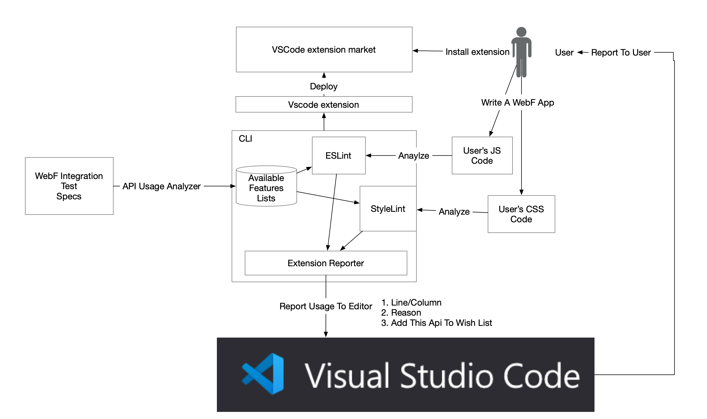

# WebF API 可用插件

## 抽象的

WebF 支持 W3C 标准功能的子集，包括 Web API 和 CSS。 但是我们的用户在实施或不支持时并不知道确切的属性。

为了帮助开发者更方便地使用 webf，我们需要开发一个代码编辑器插件来识别前端开发者项目中不支持的 W3C 特性。

## 计划

为了让它工作，我们可以在编辑时使用 ESlint 和 CSLint 静态分析用户的代码，然后找到那些不支持的属性，再通过 VSCode 插件 API 反馈给用户。

