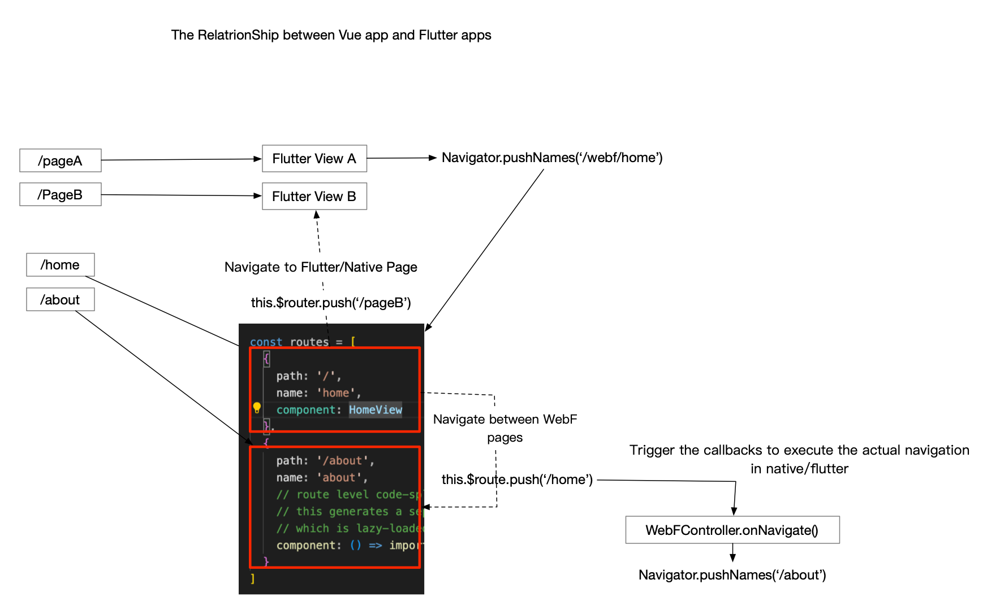
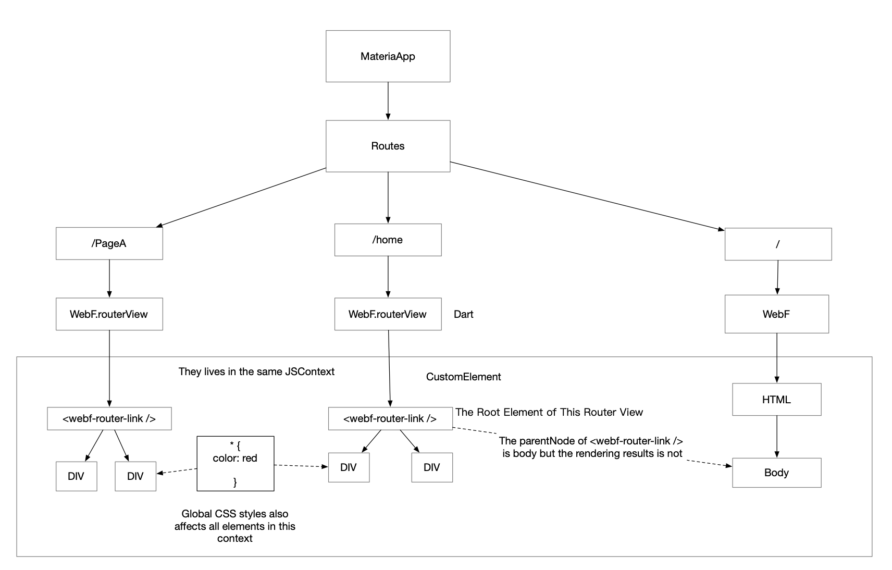

# HyBrid Routing

| --- | --- |
| Principal | @AndyCall |
| Start time | 2023-12-05 |
| Status | In Progress |

---

## Motivation

The web application and the native/flutter application each have their own method for navigation and routering. Web application rely on the History API provided by web browsers to manage different sections of pages in a single-page-application.

When navigation changes eccur, the router library uses the History.push to push a new state object, removing all DOM elements created by the previous route's pages. Subsequently, the DOM element structure for new pages begins to build and replace the structure into the original locations of previous pages. This leads to an instance update of visual effects without any animations. When user tring to navigate back, since the previous page's state is gone, the whole loading and building process will runs again, leading to unexpected user experiences.

In contrast, navigation in Native/Flutter apps tends to be more user-friendly and offers better experiences. Navigation can be triggered by swipe gestures, and animations are played during transitions. Since the state and rendering state of the previous page are still maintained, the performance of navigating back is generally better than in web-based navigation.

## Goals

This proposal is designed to introduce an native-like navigation experiences for users while utilizing web web development methods for developers.

For examples, developers familar with web frameworks and libraries like Vue and Vue-router will continue using the same API as documented in the framework. However, the behavior will differ between the WebF and web browser environments. In a web browser, there will be no changes, and everything will work as usuall. But when the same code is depolyed to WebF. it recognizies all the router configurations for the entire Vue-router based application. It then syncs these configurations with the Flutter/native router's config and creates multiple entries for each Vue router link pages. Once this process is completed, the navigation of each router link pages in WebF will utilize the navigation process provided by Flutter/Native, offering users an experience comparable to other Flutter/native pages..

## Working of process

To achieve our goals, we can divide the feature into the following tasks:

1. A customized router library: Fork vue-router for Vue users and react-router for React users.
2. One WebF running environment that can support multiple WebF entries:
   1. The WebF running environment can be initialized by a WebFController instance before creating the `WebF` widget created.
   2. Multiple WebF entries should sharing the same WebFController.
   3. The new WebF entries should be named: `WebF.RouterView`.
3. A new API in WebFController to register callbacks, triggering actual native/Flutter navigation actions when JavaScript router libraries start navigating to a new page.
4. A new API in WebFController for obtaining all router configurations, allowing Dart/Flutter developers to synchronize these configurations with their existing router configs.
5. A new built-in custom element provided to the customized router library, enabling the porting of render contents for each distinct router view. 
6. Behaviors when `WebF.RouterView` get disposed

## How WebF and Flutter Apps Collaborate in Hybrid Routing Mode

When `Hybrid Routering Mode` is enabled in WebF, each `WebF.RouterView` behaves like the standalone Flutter pages compared to other flutter pages. Each sub-view have it's own router path and can navigate to each other. The public API for triggering navigation should be the same as when running in a web browser, but the underlying implementation needs to be custom-implemented and communicate with the Dart side to notify the application to trigger navigation.

For example, in Vue.js and Vue-router applications, when the application code execute the `this.$router.push()` method to navigate to a new page. It prevents all default actions such as disposing of Vue elements and states, and sends a notification to the Dart side. This triggers the navigation callback, which then executes the `Navigator.pushNames()` method for navigation.

When users try to navigate back with a swipe-left gestures, the application animates back, and the previous page appears on the user's screen. The dart side's built-in custom elements should receive the notifications from Flutter navigation changes and send a notification event to `vue-router` to update the previous pages and set the target application as visible. The router library on the JavaScript side should find a proper ways to inform users of the current navigation status as sent from the Dart side.



## Steps to Customize a Router Library

Customizing a router library involves different steps for various web frameworks. 

Today, we'll use vue-router as an example:

As the router library was designed for SPAs in web browsers, the following APIs and behaviors need be modified in WebF:

### Customizing Router instance method: `push()`, `replace()`, `back()`, `forward()` and `go()`

These API are provides to developers for navigating to a new URL by pushing an entry into the history stack.

In WebF with hybrid routing mode enabled, these APIs should override their default behavior and instead send notifications and data to the Dart side, triggering the `WebFController.OnNavigationChanged` Dart callback.

WebF should provide internal JavaScript APIs to be called by router libraries, including:

1. webf.hybrid_history.push()
2. webf.hybrid_history.replace()
3. webf.hybrid_history.back()
4. webf.hybrid_history.forward()
5. webf.hybrid_history.go()

**Tips for Implementing These Internal WebF JavaScript APIs**

These APIs can be written in TypeScript as part of WebF's polyfill and built alongside the C++ components. 

The source code is located in the polyfill directory:

https://github.com/openwebf/webf/tree/main/bridge/polyfill/src

After modifying the sources in the polyfill directory, run npm `run build:bridge:macos` to recompile the bridge.

The [`window.location`](https://github.com/openwebf/webf/blob/main/bridge/polyfill/src/location.ts) API serves as a good example of how this can be accomplished.

On the Dart side, you need to add another module and register it in the `WebFModuleController`. There's already a module called `NavigationModule`; the only task is to add new methods and implementations to this class.

### Handling in Both Standard and Hybrid Modes

Hybrid mode is only activated when a Flutter developer uses the `WebF.RouterView` widget to render WebF apps. If the app is rendered entirely in a WebF widget, the router library should behave the same as in web browsers.

**Checking if Hybrid Mode is Enabled in JavaScript**

```javascript
console.log(window.webf.navigation.hybrid_mode); // return true when enabled
```

## Steps to Make One WebF Running Environment Support Multiple WebF Entries

This feature has already been implemented as seen in https://github.com/openwebf/webf/pull/501

## Steps to Ensure Multiple WebF Entries Share the Same WebFController

This feature has already been implemented as seen in https://github.com/openwebf/webf/pull/501

## Implementing the `WebF.RouterView` Widget

To add this feature, introduce a named constructor for the `WebF` widget and set flags to indicate that it's in hybrid mode:

```dart
class WebF extends StatefulWidget {
   WebF(
      // ...
   ): super(key: key);

   bool isHybridMode = false;

   WebF.RouterView(
      // ...
   ): isHybridMode = true, super(key: key);
}

```

In the `build` method of `WebFState`, use different widgets for different routing modes:


```dart
@override
Widget build(BuildContext context) {
   FlutterView currentView = View.of(context);
   // ...

   return RepaintBoundary(
      child: WebFContext(
         child: WebFRouterViewObjectWidget( // Use for routering view
            widget,
            currentView: currentView,
            onCustomElementAttached: onCustomElementWidgetAdd,
            onCustomElementDetached: onCustomElementWidgetRemove,
            children: customElementWidgets.toList(),
            resizeToAvoidBottomInsets: widget.resizeToAvoidBottomInsets,
         ),
      ),
   );
}
```

## New API Triggered by JavaScript Router Libraries for Navigating to a New Page

Register a Dart method callback in WebF.RouterView to initiate underlying actions when navigation changes:

```dart
WebF.RouterView(
   controller: controller,
   onNavigateChanges: (String previousRoute, String nextRoute) {
      // Execute navigation actions in Flutter
      Navigator.pushNamed(context, nextRoute);
   } 
)
```

## New API to Obtain and Synchronize Router Configurations to Flutter/Native

Add a method called `getRegisteredRoutes` in WebFController to obtain registered routes from the JavaScript side. This should be a synchronous method. 

Once the WebF application is loaded, the JavaScript router library should synchronize the router configuration with WebFController as a result of the `getRegisteredRoutes()` function.

Flutter developers using the built-in navigation system can utilize the MaterialApp widget's `onGenerateRoute` property to handle unknown paths:


```dart
static Route<dynamic> generateRoute(RouteSettings settings) {
   WebFController controller; // Obtain your page's controller instance

   List<String> webfRoutes = controller.getRegisteredRoutes();

   if (webfRoutes.contains(settings.name)) {
      return MaterialPageRoute(builder: (context) {
         return Scaffold(
            body: WebF.RouterView(
               controller: controller,
               path: settings.name,
               onNavigateChanges: (String previousRoute, String nextRoute) {
                  // Execute navigation actions in Flutter
                  Navigator.pushNamed(context, nextRoute);
               }
            )
         );
      });
   }

   // Handling unknown routes
   return MaterialPageRoute(
      builder: (_) => Scaffold(
            body: Center(
               child: Text('No route defined for ${settings.name}'),
            ),
         ));
}

// ...

MaterialApp(
   onGenerateRoute: (config) => Router.generateRoute(config),
);
```

## New Built-in Custom Elements for Customized Router Libraries

In hybrid mode, a WebF app can have multiple router views, each with its rendering content separated into the Flutter rendering tree. Although from a web developer's perspective, all router views are under the same DOM tree body, from a Flutter developer's perspective, each `WebF.RouterView` is not a child of a WebF widget but of a MaterialApp widget.

To enable the porting of render contents for each distinct router view, provide special custom element tags to be embedded into the router library. Name these custom elements `webf-router-link`.


**Tips for Router Library Developers**

Embed `<webf-router-link></webf-router-link>` elements as the root when the route matches the URL, with all DOM elements created by the application being children of `<webf-router-link />`.

For Vue Router, place `<webf-router-link />` inside the `<router-link />` Vue component.




## Behavior When `WebF.RouterView` Gets Disposed

When users navigate back, either by clicking the back button or using swipe-right gestures, WebF.RouterView gets disposed by the Flutter framework. Before this disposal, `WebF.RouterView` should send an event to the JavaScript side to trigger the disposal of JavaScript states and DOM elements.
