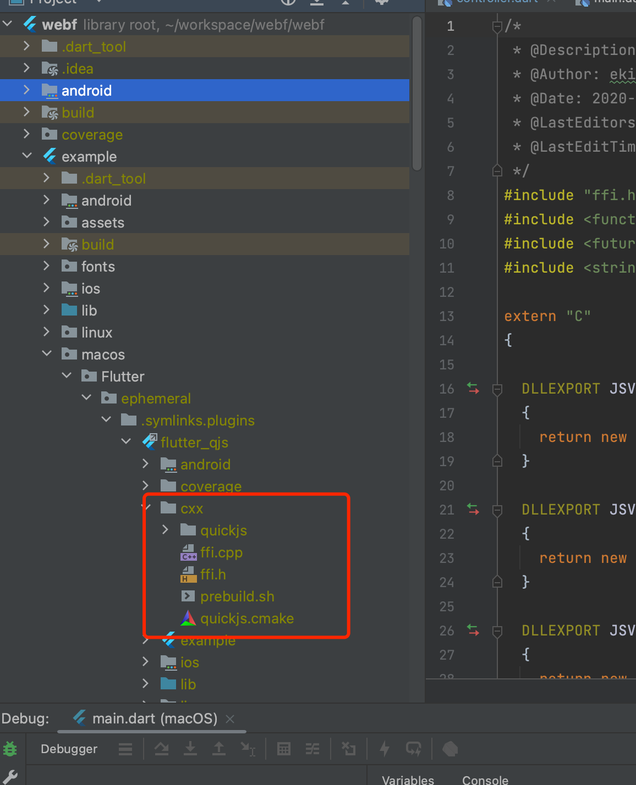

# Mercury

## Motivations

Currently in WebF, it is required that the runtime be initialized within the top level of the `Scaffold` of an active app, because it is assumed that the UI is primarily being built with web. However, this imposes a quite large restriction on the usecase of this library; it cannot be used to simply provide a full JavaScript runtime.

The existing alternatives for javascript runtimes in Flutter do not provide the same W3C compatibility that this library does, making this a good potential option for those seeking to drive a javascript backend.

## Design

### Polyfills

- `console`
- `Event` (`EventTarget`, `CustomEvent`)
- `fetch`
- `URLSearchParams`
- `URL`
- `setTimeout`, `clearTimeout`, `setInterval`
- `WebSocket` 
- `XHR`

### Features

- `MercuryRuntimeChannel` / `mercury` Runtime Channel (dart<->javascript bridge)
  ```dart
  Mercury(
    bundlePath:'assets/bundle.js',
    runtimeChannel: MercuryRuntimeChannel(),
  )
  ```
  
  ```js
  mercury.runtimeChannel
    .invokeMethod('somemethod', 'parameter 1', ['parameter 2'], {
        value: 'parmeter 3',
    })
    .then(result => {
        console.log('data from native', result);
    })
    .catch(err => {
        console.log('some error occured', err);
    });
  ```

### Extensions

- Add default domain for web requests
- Add built-in events
- Add to the global
- Add polyfills

## Collaboration with WebF

Mercury is planned as a standalone project alongside WebF, but it will operate as an internal dependency within WebF.

Three types of programming language implementations need to be shared from Mercury to WebF:

1. The Polyfill libraries.
2. The C++ DOM/Web API implementations.
3. The Dart Module systems.

### How to Share Code in the Polyfill Libraries

The following parts of the APIs are implemented using TypeScript and can be shared via npm packages:

- `console`
- `fetch`
- `URLSearchParams`
- `URL`
- `WebSocket` 
- `XHR`

All npm packages should be published under the `@openwebf` scope. Thus, this package should be named: `@openwebf/mercury`.

### The Binding Code Generator

The C++ core requires a binding code generator to produce C++ binding code, enabling compatibility with JavaScript Engines.

The binding code generator operates as a command-line tool and is also developed in TypeScript. 

Hence, we need to publish it to npm, making it available to both WebF and the Mercury library.

This package should be named: `@openwebf/code_generator`.

Both Mercury and WebF can utilize this package, integrating it into their build scripts to compile TypeScript bindings into C++ binding codes.

### Sharing C++ and Dart Codes via Flutter Packages

Flutter plugin packages allow the sharing of C++ code via `pub.dev`. Consequently, C++ implementations can be bundled into the flutter plugin for inclusion in WebF.

Upon the installation of the Flutter packages, the C++ code can be accessed from the host to the plugin using the following paths:



Recommended approach: [Native Plugin Build Tool](https://github.com/openkraken/native-plugin-build-tool#readme)

These paths can be manually included as needed.

### C++ Implementations to be Moved to Mercury

Mercury's C++ implementations should include the QuickJS runtimes, ExecutionContext, ScriptState, Binding Tools, foundation libraries, and the following APIs:

- `Event` (`EventTarget`, `CustomEvent`)
- `setTimeout`, `clearTimeout`, `setInterval`

A comprehensive list is provided below:

- bridge/bindings/*
- bridge/foundation/*
- bridge/core/dom/events/*
- bridge/third_party/quickjs/*
- bridge/core/binding_object.h
- bridge/core/binding_object.cc
- bridge/core/dart_context_data.cc
- bridge/core/dart_context_data.h
- bridge/core/dart_isolate_context.cc
- bridge/core/dart_isolate_context.h
- bridge/core/dart_methods.h
- bridge/core/dart_methods.cc
- bridge/core/executing_context.cc
- bridge/core/executing_context.h
- bridge/core/executing_context_data.cc
- bridge/core/executing_context_data.h
- bridge/core/page.h
- bridge/core/page.cc
- bridge/core/script_state.cc
- bridge/core/script_state.h
- bridge/core/frame/console.cc
- bridge/core/frame/console.h
- bridge/core/frame/console.d.ts
- bridge/core/frame/dom_timer.cc
- bridge/core/frame/dom_timer.h
- bridge/core/frame/dom_timer_coordinator.cc
- bridge/core/frame/dom_timer_coordinator.h
- bridge/core/frame/dom_timer_test.cc
- bridge/core/frame/module_callback.cc
- bridge/core/frame/module_callback.h
- bridge/core/frame/module_context_coordinator.cc
- bridge/core/frame/module_context_coordinator.h
- bridge/core/frame/module_listener.cc
- bridge/core/frame/module_listener.h
- bridge/core/frame/module_listener_container.cc
- bridge/core/frame/module_listener_container.h
- bridge/core/frame/module_manager.cc
- bridge/core/frame/module_manager.h
- bridge/core/frame/window_or_worker_global_scope.h
- bridge/core/frame/window_or_worker_global_scope.cc
- bridge/core/frame/window_or_worker_global_scope.d.ts

### The Dart codes needs to be moved to mercury

1. The Dart implements for setTimeout and setInterval:

- webf/lib/src/module/timer.dart
- webf/lib/src/bridge/binding.dart
- webf/lib/src/bridge/bridge.dart
- webf/lib/src/bridge/from_native.dart
- webf/lib/src/bridge/to_native.dart

2. The module systems:

- The WebFModuleController class in webf/lib/src/launcher/controller.dart
- webf/lib/src/module/fetch.dart
- webf/lib/src/module/method_channel.dart (should be renamed to runtimeChannel)
- webf/lib/src/module/schedule_frame.dart
- webf/lib/src/module/timer.dart
- webf/lib/src/module/websocket.dart

